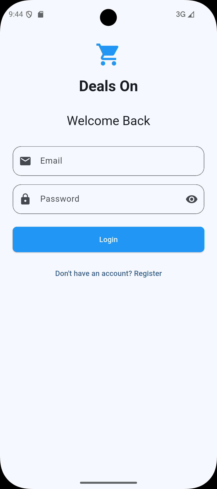
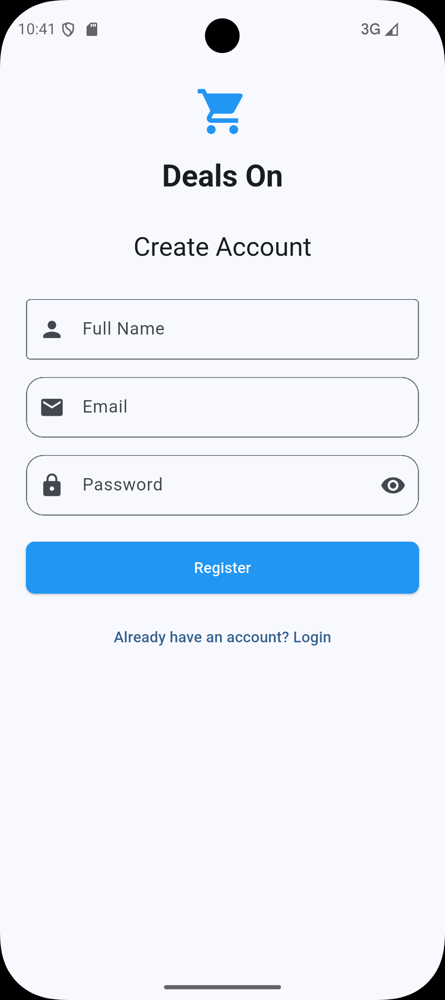
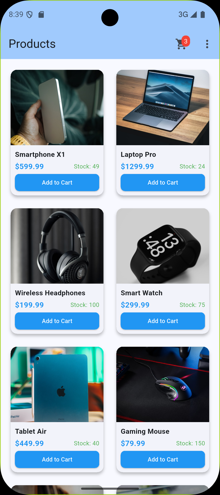
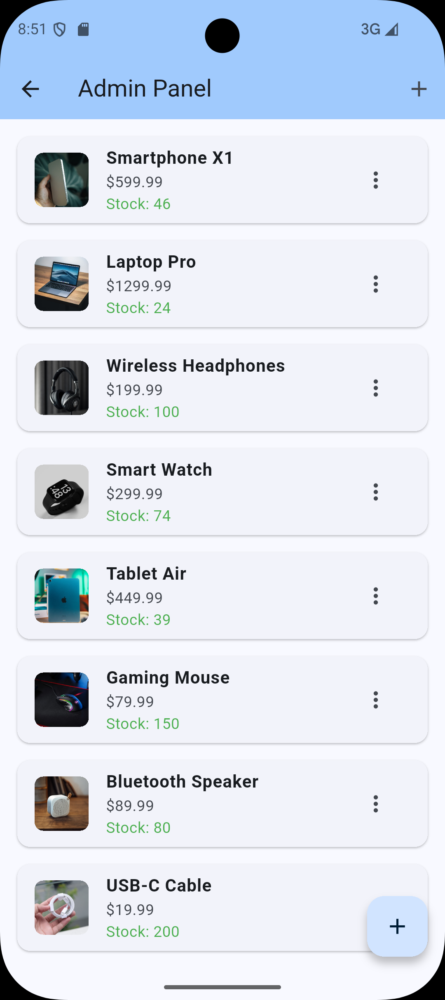
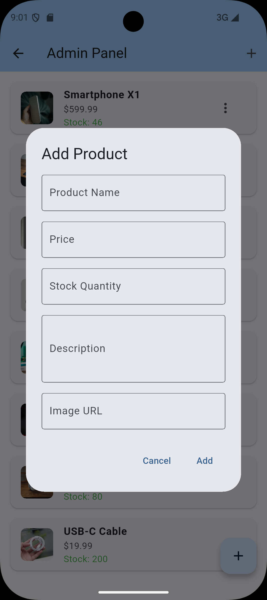
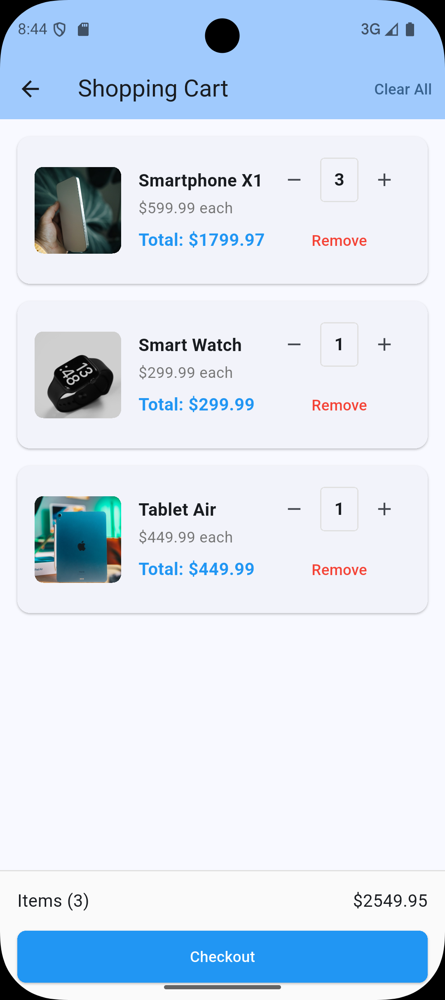
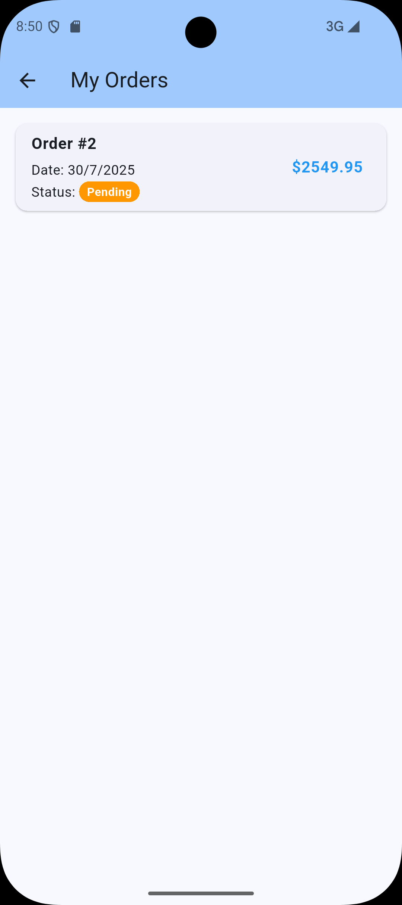

# Deals On: Micro-Commerce App

A mobile e-commerce application built with **Flutter** (frontend) and **Node.js + Express** (backend) using **SQLite** database.

      

## 🚀 Features

### Core Functionality
- **Authentication**: Email/password signup & login using JWT
- **Product Management**: Browse and view products
- **Shopping Cart**: Add/remove items, update quantities, calculate totals
- **Order Management**: Create orders, view order history, inventory management
- **Admin Panel**: Create, edit, delete products (admin-only access)

### Technical Features
- RESTful API with proper error handling
- JWT-based authentication with role-based access control
- SQLite database with proper relationships
- Input validation and security middleware
- Comprehensive test coverage (5+ backend tests)
- Responsive Flutter UI with state management

## 🛠 Tech Stack

### Backend
- **Runtime**: Node.js 17+
- **Framework**: Express.js
- **Database**: SQLite
- **Authentication**: JWT + bcryptjs
- **Testing**: Jest + Supertest
- **Validation**: Custom middleware

### Frontend
- **Framework**: Flutter >=3.x
- **State Management**: Provider
- **HTTP Client**: http package
- **Local Storage**: SharedPreferences

## 📦 Project Structure

```
Deals On/
├── server/
│   ├── routes/
│   ├── models/
│   ├── middleware/
│   ├── tests/
│   └── data/
└── client/
    ├── lib/
    │   ├── models/
    │   ├── providers/
    │   ├── screens/
    │   ├── services/
    │   └── widgets/
    └── assets/
```

## 🚦 Quick Start

### Prerequisites
- Node.js (v18 or higher)
- Flutter (v3.0 or higher)
- Git

### Backend Setup

1. **Clone and navigate to server directory**
   ```bash
   git clone https://github.com/GChukwudi/Deals-On
   cd Deals-On
   ```

2. **Install dependencies**
   ```bash
   npm install
   ```

3. **Set up environment variables**
   ```bash
   cp .env.example .env
   # Edit .env with your configurations
   ```

4. **Initialize database and seed data**
   ```bash
   npm run seed
   ```

5. **Start development server**
   ```bash
   npm run dev
   ```

   Server will run on `http://localhost:3000`

### Frontend Setup

1. **Navigate to client directory**
   ```bash
   cd ../client
   ```

2. **Get Flutter dependencies**
   ```bash
   flutter pub get
   ```

3. **Update API base URL** (if needed)
   
   Edit `lib/utils/constants.dart`:
   ```dart
   // For Android emulator
   static const String baseUrl = 'http://10.0.2.2:3000/api';
   
   // For iOS simulator
   static const String baseUrl = 'http://localhost:3000/api';
   
   // For physical device (replace with your IP)
   static const String baseUrl = 'http://YOUR_IP:3000/api';
   ```

4. **Run the app**
   ```bash
   flutter run
   ```

## 🔑 Demo Credentials

The app comes with pre-seeded demo accounts:

- **Admin Account**
  - Email: `admin@kenkeputa.com`
  - Password: `admin123`
  - Access: Full admin panel, product management

- **User Account**
  - Email: `user@test.com`
  - Password: `user123`
  - Access: Shopping features, order history

## 📡 API Endpoints

### Authentication
```
POST   /api/auth/register
POST   /api/auth/login
GET    /api/auth/profile
```

### Products
```
GET    /api/products
GET    /api/products/:id
POST   /api/products
PUT    /api/products/:id
DELETE /api/products/:id
```

### Shopping Cart
```
GET    /api/cart
POST   /api/cart/items
PUT    /api/cart/items/:id
DELETE /api/cart/items/:id
DELETE /api/cart
```

### Orders
```
GET    /api/orders
POST   /api/orders
GET    /api/orders/admin/all
```

### Example API Requests

**Login:**
```bash
curl -X POST http://localhost:3000/api/auth/login \
  -H "Content-Type: application/json" \
  -d '{"email": "user@test.com", "password": "user123"}'
```

**Get Products:**
```bash
curl http://localhost:3000/api/products
```

**Add to Cart:**
```bash
curl -X POST http://localhost:3000/api/cart/items \
  -H "Content-Type: application/json" \
  -H "Authorization: Bearer YOUR_JWT_TOKEN" \
  -d '{"product_id": 1, "quantity": 2}'
```

## 🧪 Testing

### Backend Tests
```bash
cd server
npm test
```

The test suite includes:
- **Authentication tests** (`tests/auth.test.js`)
- **Product CRUD tests** (`tests/products.test.js`)
- **Cart functionality tests** (`tests/cart.test.js`)
- **Order processing tests** (`tests/orders.test.js`)
- **Admin access control tests** (`tests/admin.test.js`)

### Test Coverage
- User registration and login
- JWT authentication and authorization
- Product CRUD operations with admin checks
- Cart management (add, update, remove items)
- Order creation with inventory updates
- Role-based access control
- Input validation and error handling

## 🛡 Security Features

- **JWT Authentication**: Secure token-based authentication
- **Password Hashing**: bcryptjs for secure password storage
- **Role-based Access**: Admin-only endpoints protection
- **Input Validation**: Server-side validation for all inputs
- **CORS Protection**: Configured CORS policy
- **SQL Injection Prevention**: Parameterized queries

## App Features

### User Flow
1. **Authentication**: Login or register
2. **Browse Products**: View product catalog
3. **Shopping Cart**: Add items, manage quantities
4. **Checkout**: Place orders with inventory validation
5. **Order History**: View past orders

### Admin Flow
1. **Admin Login**: Use admin credentials
2. **Product Management**: Create, edit, delete products
3. **Order Monitoring**: View all customer orders
4. **Inventory Control**: Manage stock levels

## 🚧 Known Limitations

- **Image Upload**: Currently uses URL-based images only
- **Payment Integration**: Mock checkout (no real payment processing)
- **Email Notifications**: Not implemented
- **Advanced Filtering**: Basic product filtering only
- **User Profiles**: Limited profile management

## 🔄 Development Scripts

### Backend
```bash
npm start          # Production server
npm run dev        # Development server with nodemon
npm test           # Run test suite
npm run seed       # Seed database with sample data
```

### Frontend
```bash
flutter run        # Run in development mode
flutter build apk  # Build Android APK
flutter test       # Run Flutter tests
```

## 📊 Database Schema

The SQLite database includes these main tables:
- **users**: User accounts and roles
- **products**: Product catalog
- **cart_items**: Shopping cart contents
- **orders**: Order records with JSON items
- **Relationships**: Proper foreign key constraints

## 🤝 Development Notes

This project was built as a technical assessment demonstrating:
- Full-stack development capabilities
- RESTful API design
- Database design and relationships
- Authentication and authorization
- Mobile app development with Flutter
- Test-driven development practices
- Clean code architecture

## 📄 License

This project is for assessment purposes.

---

**Built with ❤️ for Kenkeputa Technical Assessment**